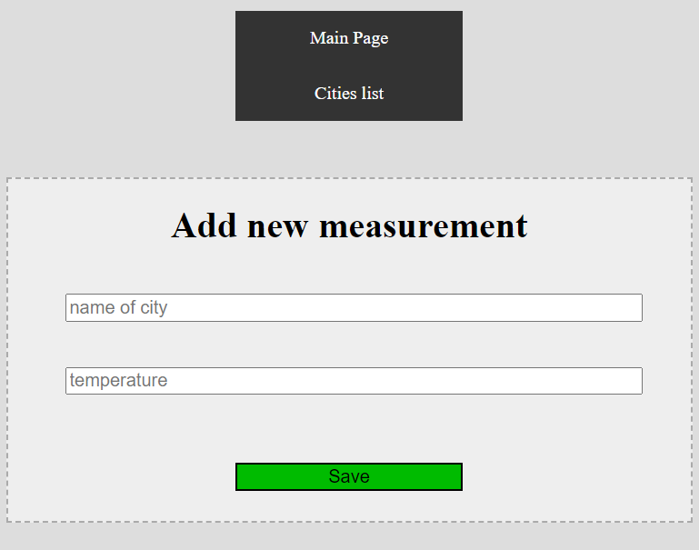

# Temperature Recorder App

## General Information
The simple small app, which allows users to record their measurements of temperatures.

## Screenshots

### Form add training

### Trainings list

## Technologies Used
- Java
- Spring
- HTML
- CSS

## Features
- form add new measurement
- table with averages temperatures for cities
- navigation buttons

### Functions
- calculate average temperatures
- add new measurement to app memory
- display a list of cities average temperatures (24h/daily/night/all country)

## Usage
Run main method in TemperatureRecordAppApplication class and enter "localhost:8080" to browser window.